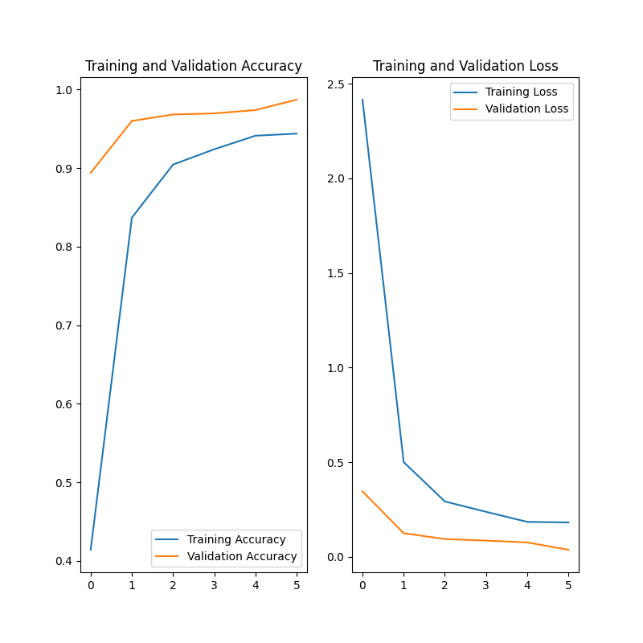

# Fruit Recognizer

## Goal
Recognize fruits! Because, why not?

## Dataset
It's currently using the [Fruits-360](https://www.kaggle.com/moltean/fruits) dataset

## Challenges
The models I've been trying are doing great validation and training accuracy wise, the fruit 360 dataset is very limited only containing 7 fruits in total, therefore I couldn't test it with fruits that look alike, however it's having a really hard time distinguishing a zucchini from a cucumber (I do too).

## Directory structure

- `/models` - All trained models are saved here with some information about them on the title.
- `main.py` - Holds the current code for training the model
- `predicter.py` - Run this to predict results on a given image or generator
- `Figures_{}.png` - Val/Train Loss and Accuracy.

## History

Results from running a model, this is the average accuracy and loss.

